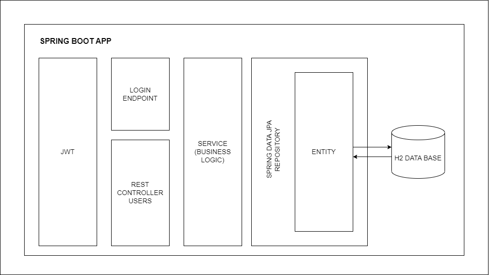
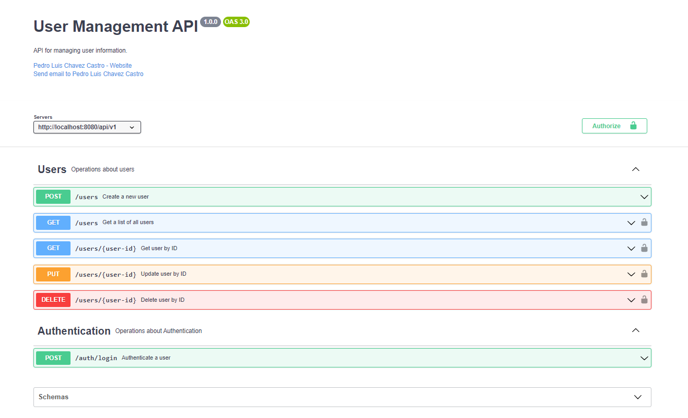
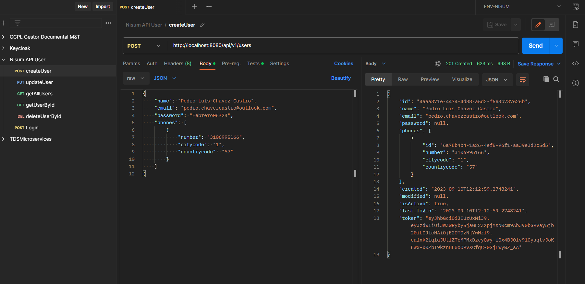
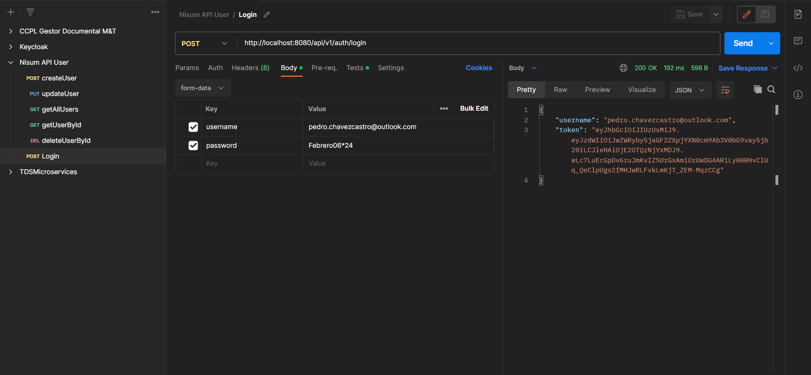
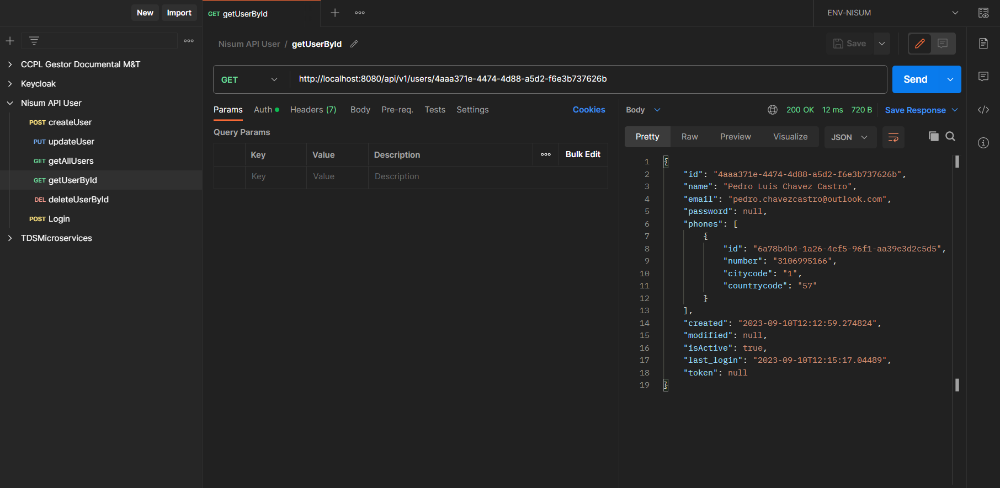
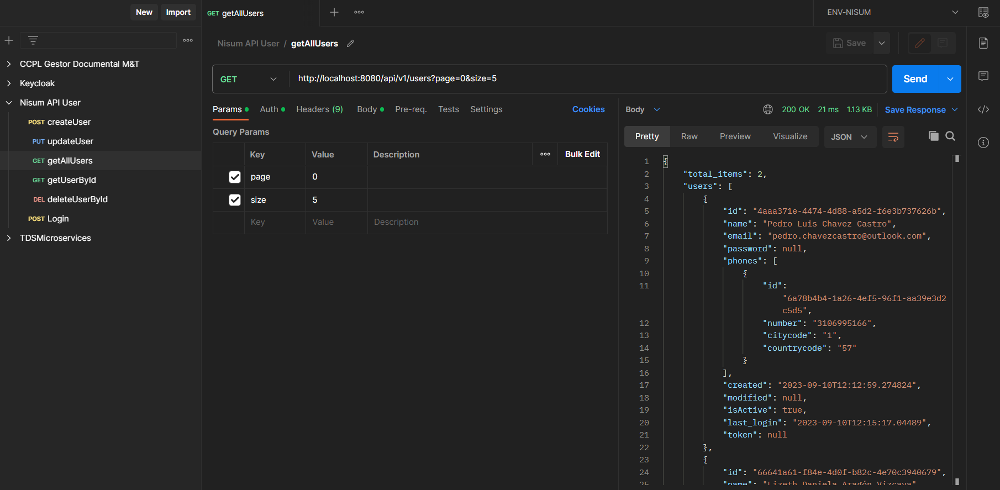
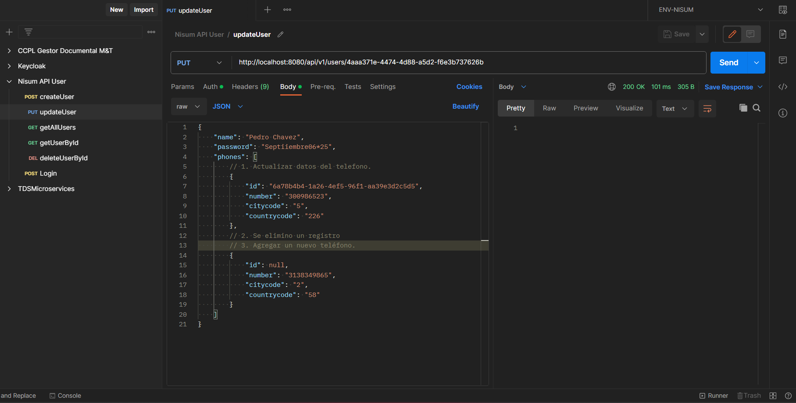
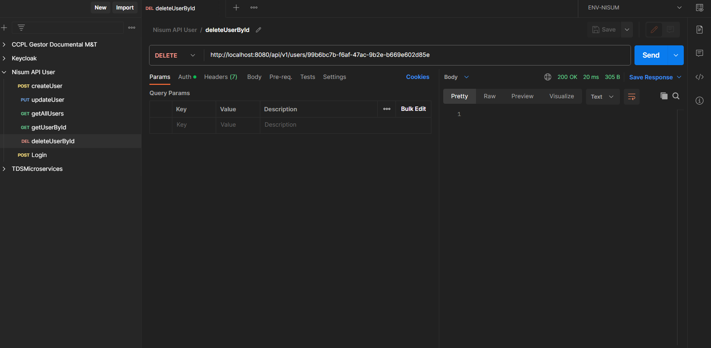

# Nisum - Microservicio de Gestión de Usuarios

Este microservicio proporciona una API para gestionar la información de los usuarios. Está construido con Spring Boot y utiliza Maven para la gestión de dependencias.

<!-- TOC -->
* [Nisum - Microservicio de Gestión de Usuarios](#nisum---microservicio-de-gestión-de-usuarios)
  * [Diagrama de la solución Perspectiva Backend](#diagrama-de-la-solución-perspectiva-backend)
  * [Modelo Base de Datos H2 en Memoria](#modelo-base-de-datos-h2-en-memoria)
    * [Tabla "users"](#tabla--users-)
    * [Tabla "phones"](#tabla--phones-)
  * [Instalación y Configuración](#instalación-y-configuración)
  * [Especificación OpenAPI/Swagger](#especificación-openapiswagger)
  * [Postman](#postman)
  * [Uso de la API](#uso-de-la-api)
    * [Registro de Usuarios](#registro-de-usuarios)
    * [Autenticación de Usuario](#autenticación-de-usuario)
    * [Obtener Usuario por ID](#obtener-usuario-por-id)
    * [Obtener Lista de Usuarios](#obtener-lista-de-usuarios)
    * [Actualizar Usuario por ID](#actualizar-usuario-por-id)
    * [Desactivar Usuario por ID](#desactivar-usuario-por-id)
  * [Contacto](#contacto)
<!-- TOC -->

## Diagrama de la solución Perspectiva Backend



## Modelo Base de Datos H2 en Memoria

Esta sección proporciona un script SQL para crear las tablas necesarias en una base de datos H2 en memoria para el sistema de gestión de usuarios.

### Tabla "users"

La tabla "users" almacenará la información de los usuarios.

```sql
DROP TABLE IF EXISTS users;

CREATE TABLE users (
    id UUID PRIMARY KEY,
    name VARCHAR(50),
    email VARCHAR(255) UNIQUE,
    password VARCHAR(255),
    created TIMESTAMP,
    modified TIMESTAMP,
    last_login TIMESTAMP,
    is_active BOOLEAN,
    access_token VARCHAR(255)
);
```

### Tabla "phones"

La tabla "phones" almacenará la información de los teléfonos asociados a los usuarios.

```sql
DROP TABLE IF EXISTS phones;

CREATE TABLE phones (
    id UUID PRIMARY KEY,
    number VARCHAR(20),
    city_code VARCHAR(10),
    country_code VARCHAR(10),
    id_user_fk UUID,
    FOREIGN KEY (id_user_fk) REFERENCES users(id)
);
```

## Instalación y Configuración

Para ejecutar este microservicio en un entorno local, tenga en cuenta los siguientes pasos:

1. Clonar este repositorio.
4. Ejecutar el comando `mvn clean generate-sources`
5. Ejecuta la aplicación Spring Boot con el comando `mvn spring-boot:run`
5. La API estará disponible en `http://localhost:8080/api/v1`.

## Especificación OpenAPI/Swagger

La especificación OpenAPI/Swagger utilizada como base para el desarrollo de esta aplicación se encuentra en la carpeta "api" en la raíz del proyecto. Esta especificación define la estructura de la API, incluyendo los endpoints, los objetos de datos y la documentación de los servicios disponibles.



El archivo de especificación OpenAPI/Swagger se encuentra en la siguiente ubicación:

`/api/ccpl-nisum-users-api.yml`

## Postman

A continuación, podra descargar la colección Postman del API.

- [ENV-NISUM.postman_environment.json](src%2Fmain%2Fresources%2Fdocumentation%2FpostmanCollection%2FENV-NISUM.postman_environment.json)
- [Nisum API User.postman_collection.json](src%2Fmain%2Fresources%2Fdocumentation%2FpostmanCollection%2FNisum%20API%20User.postman_collection.json)

## Uso de la API

### Registro de Usuarios

Este endpoint permite crear un nuevo usuario en el sistema proporcionando la información del mismo en formato JSON.
El servicio retornará los datos relacionados al usuario que se creó, dentro de estos datos se retornará un token JWT 
válido que puede ser usado para acceder a otros endpoints protegidos.

- **URL**: `/api/v1/users`
- **Método**: `POST`
- **Headers**:
    - `Content-Type: application/json`
    - **Autorización**: No se requiere autorización para crear un nuevo usuario.

**Ejemplo de Solicitud en Postman**



### Autenticación de Usuario

Este endpoint permite autenticar un usuario proporcionando su nombre de usuario (correo electrónico) y contraseña. 
Si la autenticación es exitosa, se retornará un token JWT válido que puede ser usado para acceder a otros endpoints protegidos.

- **URL**: `/api/v1/auth/login`
- **Método**: `POST`
- **Headers**:
  - `Content-Type: application/x-www-form-urlencoded`
  - **Autorización**: No se requiere autorización para autenticar un usuario.

**Ejemplo de Solicitud en Postman**



### Obtener Usuario por ID

Este endpoint permite obtener el perfil de un usuario específico proporcionando su ID único.

- **URL**: `/api/v1/users/{user-id}`
- **Método**: `GET`
- **Headers**:
  - **Autorización**: Se requiere un token JWT válido para acceder a este endpoint.

**Ejemplo de Solicitud en Postman**

Reemplazar `{user-id}` con el ID real del usuario que requiere obtener.



### Obtener Lista de Usuarios

Este endpoint permite obtener una lista de todos los perfiles de usuario en el 
sistema. Puede hacer uso de la paginación para controlar la cantidad de resultados 
que se muestran en cada página.

- **URL**: `/api/v1/users`
- **Método**: `GET`
- **Headers**:
  - **Autorización**: Se requiere un token JWT válido para acceder a este endpoint.

***Ejemplo de Solicitud en Postman***



### Actualizar Usuario por ID

Este endpoint permite actualizar el perfil de un usuario específico proporcionando
su ID único. Los datos que son posibles modificar son: el nombre, la contraseña y
los números de teléfono de contacto del usuario.

- **URL**: `/api/v1/users/{user-id}`
- **Método**: `PUT`
- **Headers**:
  - **Autorización**: Se requiere un token JWT válido para acceder a este endpoint.

**Ejemplo de Solicitud en Postman**

Reemplazar `{user-id}` con el ID real del usuario que requiere actualizar. En el cuerpo de la solicitud, proporciona los datos a actualizar en formato JSON como se muestra en el ejemplo a continuación.

Tener en cuenta lo siguientes casos:

1.	Modificar teléfono existente: En caso de requerir modificar datos asociados a un teléfono de contacto especifico (existente) se debe proporcionar el id del mismo generado en la creación y actualizar los demás campos según aplique.
2.	Eliminar teléfono: En caso de requerir eliminar un teléfono de contacto solo es necesario remover completamente el registro de la lista.
3.	Agregar nuevo teléfono: En caso de requerir agregar un nuevo teléfono de contacto, es necesario agregar un nuevo registro a la lista estableciendo el campo “id” como null.



### Desactivar Usuario por ID

Este endpoint permite desactivar (realizar una eliminación lógica) un usuario específico proporcionando su ID único. La desactivación implica que el usuario ya no estará activo en el sistema, pero su perfil se mantendrá para futuras referencias.

- **URL**: `/api/v1/users/{user-id}`
- **Método**: `DELETE`
- **Headers**:
  - **Autorización**: Se requiere un token JWT válido para acceder a este endpoint.

**Ejemplo de Solicitud en Postman**

Reemplazar `{user-id}` con el ID real del usuario que requiere desactivar.



## Contacto
  
- Nombre: Pedro Luis Chavez Castro
- Correo electrónico: chavezcastro.pedroluis98@gmail.com
- LinkedIn: [Perfil de LinkedIn](https://www.linkedin.com/in/pedro-luis-chavez-castro-2b60401a5/)

